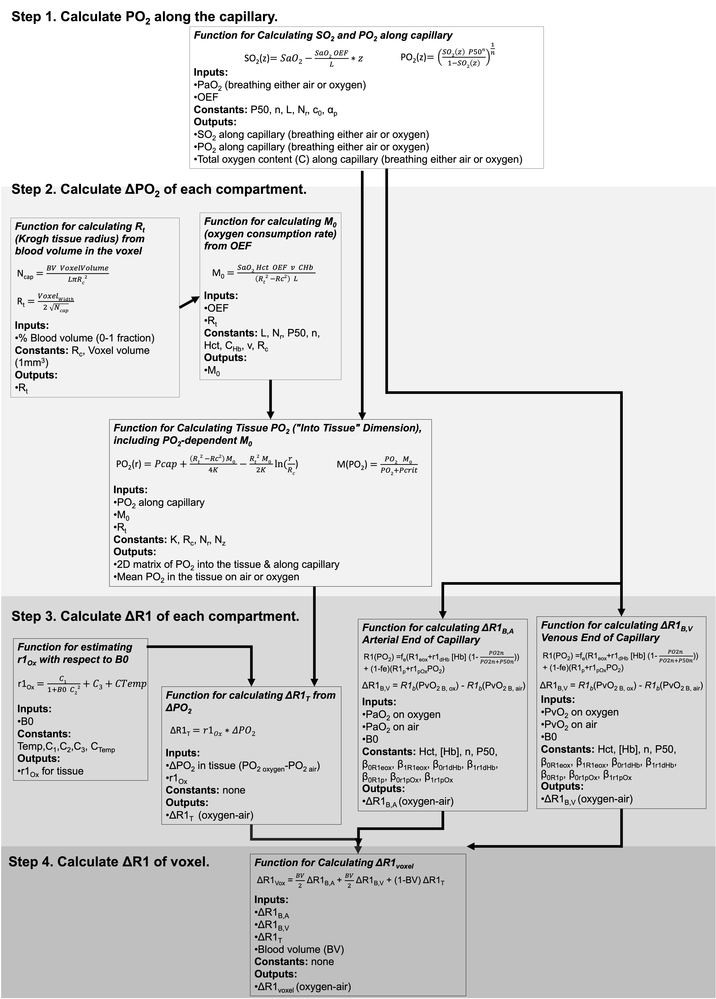

# Modelling the effect of hyperoxia on the spin-lattice relaxation rate R1 of tissues

 Emma Bluemke, Eleanor Stride, Daniel Peter Bulte 
    
Institute of Biomedical Engineering, Department of Engineering Sciences, University of Oxford, UK

<i> Questions? Raise an issue here on GitHub</i>

----------------------------

This is the accompanying code for our manuscript, "Modelling the effect of hyperoxia on the spin-lattice relaxation rate R1 of tissues", where we present a 3-compartment model for estimating the hyperoxia-induced changes in R1 of tissues depending on B0, SO2, blood volume, hematocrit, oxygen extraction fraction, and changes in blood and tissue PO2. 

<b>Please see the main manuscript for full theory explanation and details.</b>

----------------------------

### The model can be conceptually separated into 4 steps: 

<b>Step 1. Calculate PO2 along the capillary.</b> The ΔR1B,deOx and ΔR1T and ΔR1B,Ox are all related by a calculation of the SO2 or PO2 along the capillary length, which is determined by the arterial PO2 and the OEF of the tissue.

<b>Step 2. Calculate ΔPO2 of each compartment.</b> Knowing the PO2 along the capillary allows the ΔPO2 from oxygen administration to be calculated in the blood and tissue compartments, using the Krogh tissue cylinder to model the oxygen diffusion into the tissue, and the set OEF is related to the tissue oxygen consumption rate. The Krogh tissue cylinder radius is calculated from the set blood volume.

<b>Step 3. Calculate ΔR1 of each compartment.</b> Knowing the ΔPO2 in each compartment allows the ΔR1T to be calculated using the r1Ox (calculated with respect to B0 using a model published by Bluemke et al.(https://doi.org/10.1002/nbm.4625)); the ΔR1 of each blood compartment to be calculated using a Blood R1 model published by Bluemke et al. (https://doi.org/10.1002/jmri.27938). 

<b>Step 4. Calculate ΔR1 of voxel.</b> Once the ΔR1 in each compartment is calculated, we use the set blood volume fraction (BV) to calculate the resulting ΔR1 of the voxel (ΔR1voxel). 

--------------

